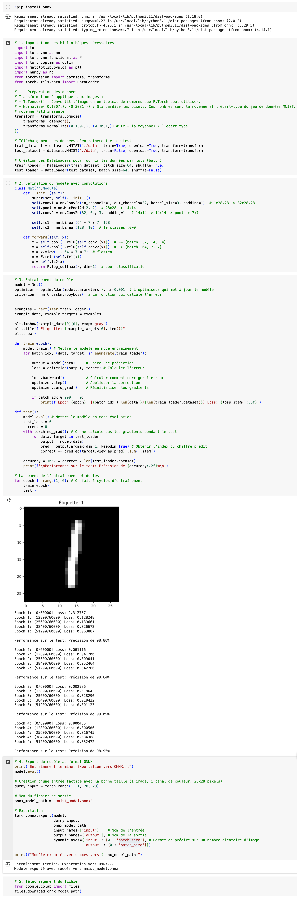

# 🚀 Projet 1 : Classification MNIST

Ce projet propose une Intelligence Artificielle de classification de chiffres manuscrits basée sur le célèbre dataset **MNIST**. Le modèle est pré-entraîné, exporté au format ONNX, et intégré dans une page web interactive pour effectuer des prédictions directement côté client grâce à **onnxruntime-web**.

---

## 🌟 Fonctionnalités

- **Prédiction instantanée** de chiffres manuscrits (0 à 9) sur le navigateur
- **Modèle pré-entraîné** (export ONNX, prêt à l’emploi)
- **Interface web intuitive** : dessine, prédis, efface, recommence !
- **Aperçu du 28x28 envoyé au modèle** pour visualiser ce que "voit" l’IA

---

## 📦 Livrables

- **Modèle ONNX** (`mnist_model.onnx`) directement utilisable
- **Page web interactive** (`index.html`, `script.js`) pour tester le modèle
- **Capture d’écran** du code d’entraînement (Google Colab) : `training.png`

> ⚡ **NB :** Aucun entraînement n’est à réaliser ici, le modèle est déjà fourni et opérationnel !

---

## 🛠️ Architecture du Projet
├── index.html # Page web interactive MNIST <br />
├── script.js # Logique JS pour le dessin et la prédiction <br />
├── mnist_model.onnx # Modèle pré-entraîné exporté en ONNX <br />
├── training.png # Capture d'écran du code d'entraînement (Google Colab) <br />
├── LICENSE <br />
└── README.md

---

## 🎨 Démo



---

## 🖥️ Utilisation

1. **Clone le repo :**
   ```bash
   git clone https://github.com/IDRAYNAR/MNIST.git
2. Ouvre index.html dans ton navigateur
3. Dessine un chiffre dans la zone blanche
4. Clique sur "Prédire" pour obtenir la classification du modèle

---

## ⚙️ Détails Techniques

- Modèle PyTorch entraîné sur MNIST puis exporté en ONNX
- Inference côté client avec onnxruntime-web
- Prétraitement des images : normalisation, mise à l’échelle 28x28, conversion en niveau de gris

---

## 📝 License

Ce projet est sous licence MIT.
